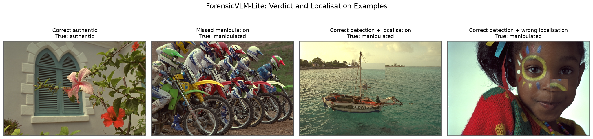
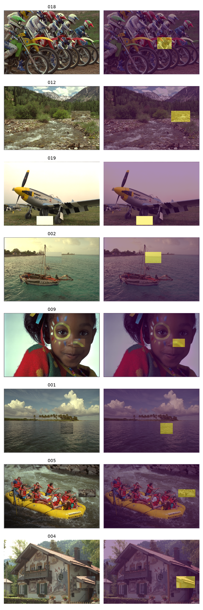
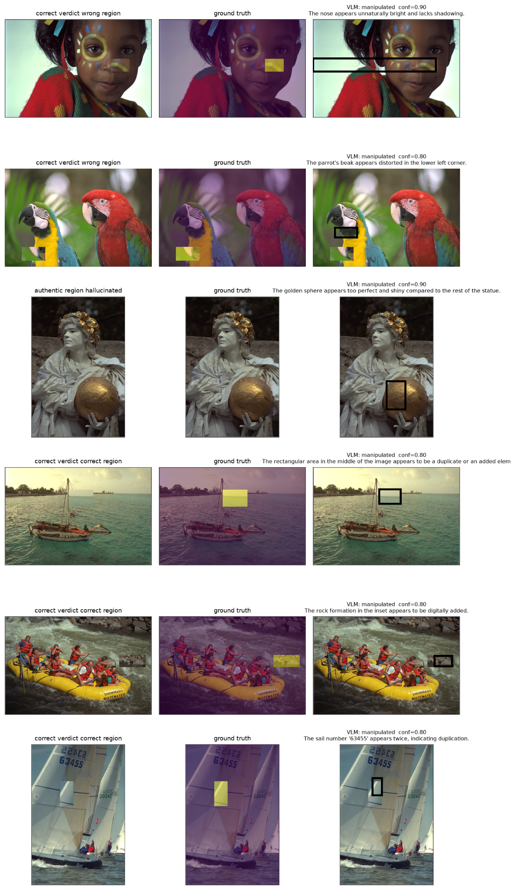

# ForensicVLM-Lite

Small demo for one question:

**If a VLM correctly says an image was manipulated, is the region it points to actually the edited region?**

This is not a benchmark. The default run is 20 matched source/manipulated pairs (40 images), one Qwen model, and no training.

## Demo result

This repository includes one completed illustrative run on 20 matched authentic/manipulated pairs (40 images total) using `Qwen/Qwen2.5-VL-7B-Instruct`.

| Metric | Result |
|---|---:|
| Accuracy | 72.5% |
| Balanced accuracy | 72.5% |
| Manipulation sensitivity | 50.0% (10/20) |
| Authentic specificity | 95.0% (19/20) |
| Correct localisation among correctly detected manipulations | 80.0% (8/10) |
| Hallucinated region on authentic images | 5.0% (1/20) |

The main observation is asymmetric behaviour: the model is much better at recognising authentic images than detecting the controlled copy-move manipulations. When it does correctly detect a manipulation, the predicted region is usually spatially consistent with the ground-truth edited region.

### Qualitative examples



The four panels show a correct authentic verdict, a missed manipulation, a correctly detected and localised manipulation, and a correctly detected manipulation with incorrect localisation.

### Pair and mask check



### Additional examples



## Setup

```powershell
python -m pip install -r requirements.txt
```

## 1. Prepare the tiny demo data

```powershell
python -m run_demo --prepare --n-pairs 20
```

This downloads 20 Kodak photographs and makes one controlled copy-move edit from each source image. Because the edit is made locally, the authentic source and the manipulation mask are exact pairs.

This controlled set is only for demonstrating the evaluation idea. It should not be described as a real-world forensic benchmark.

## 2. Check the masks

```powershell
python -m run_demo --check-data --n-pairs 20
```

Open `figures/check_pairs.png`. The overlay should sit on the pasted region.

## 3. Run Qwen

```powershell
python -m run_demo --n-pairs 20
```

Small first run:

```powershell
python -m run_demo --n-pairs 4
```

Test the code path without loading Qwen:

```powershell
python -m run_demo --n-pairs 4 --dry-run
```

Cached answers go to `results/raw/`. Add `--fresh` to ignore them.

## Outputs

- `results/results.csv`
- `results/summary.json`
- `figures/examples.png`
- `figures/check_pairs.png`
- `figures/four_cases.png`

The categories kept separate are:

- correct verdict + correct region
- correct verdict + wrong region
- correct verdict + no region
- region reported on an authentic image

With 40 images the rates are illustrative. The useful part is being able to inspect the failure cases directly.

These numbers are from a small controlled demo and should not be interpreted as a general benchmark of VLM forensic performance.
